# AI Resume Screener - Process Flow & Architecture Analysis

## 📋 Table of Contents

- [System Overview](#system-overview)
- [Architecture Diagram](#architecture-diagram)
- [Frontend Architecture](#frontend-architecture)
- [Backend Architecture](#backend-architecture)
- [Process Flows](#process-flows)
- [Data Flow Diagrams](#data-flow-diagrams)
- [Component Interactions](#component-interactions)

---

## System Overview

The AI Resume Screener is a full-stack application that automates the resume screening process using AI. It supports two AI modes:

1. **Backend Gemini API** - Server-side AI analysis using Google's Gemini Pro
2. **Puter.js Free AI** - Client-side AI analysis using Claude Sonnet 4 (no API key required)

### Technology Stack

**Frontend:**

- React 18 with Vite
- Vanilla CSS with CSS Variables
- File handling with FileReader API
- Puter.js SDK for free AI

**Backend:**

- FastAPI (Python)
- Google Gemini AI (gemini-pro)
- PyPDF2 & pdfplumber for PDF parsing
- python-docx for DOCX parsing
- In-memory storage (candidates_db)

---

## Architecture Diagram

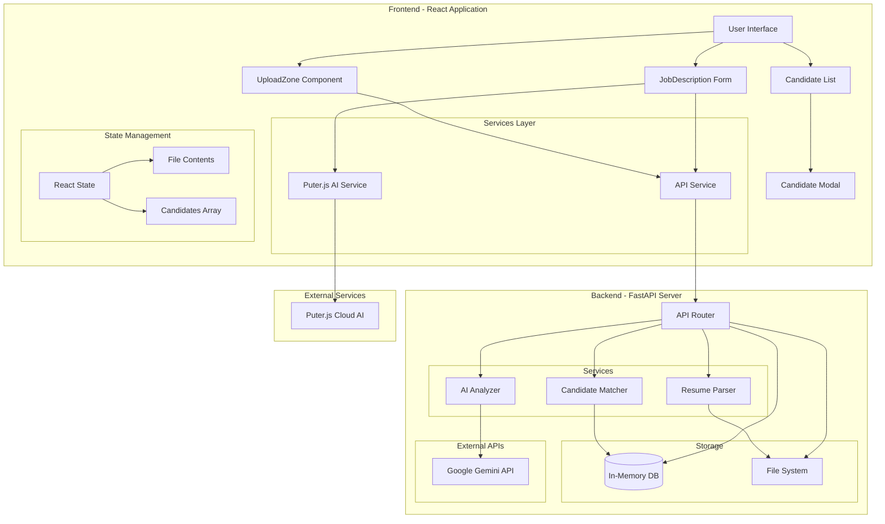

---

## Frontend Architecture

### Component Hierarchy

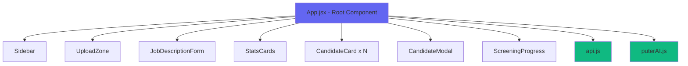

### State Management

The application uses React's `useState` hook for state management:

| State Variable | Purpose |
|----------------|---------|
| `activeSection` | Current view (dashboard, upload, candidates, shortlisted, settings) |
| `isDarkMode` | Theme toggle |
| `candidates` | Array of all candidate objects |
| `stats` | Statistics (total, analyzed, shortlisted, rejected, avg_score) |
| `progress` | Real-time analysis progress tracking |
| `uploadedFiles` | Files uploaded but not yet analyzed |
| `fileContents` | Raw file objects for Puter.js analysis |
| `usePuterAI` | Toggle between Puter.js and Backend AI |

### Key Frontend Components

#### 1. **UploadZone.jsx**

- Drag-and-drop file upload
- File validation (.pdf, .docx, .doc)
- Multiple file selection
- Visual feedback during upload

#### 2. **JobDescriptionForm.jsx**

- Job title and description input
- Required/preferred skills management
- Minimum experience specification
- Dual submit buttons (Backend vs Puter AI)

#### 3. **CandidateCard.jsx**

- Display candidate summary
- Match score visualization
- Quick actions (View, Shortlist, Reject)
- Status badges

#### 4. **CandidateModal.jsx**

- Detailed candidate view
- Skills breakdown
- Experience timeline
- Education history
- AI recommendations

---

## Backend Architecture

### API Routes Structure

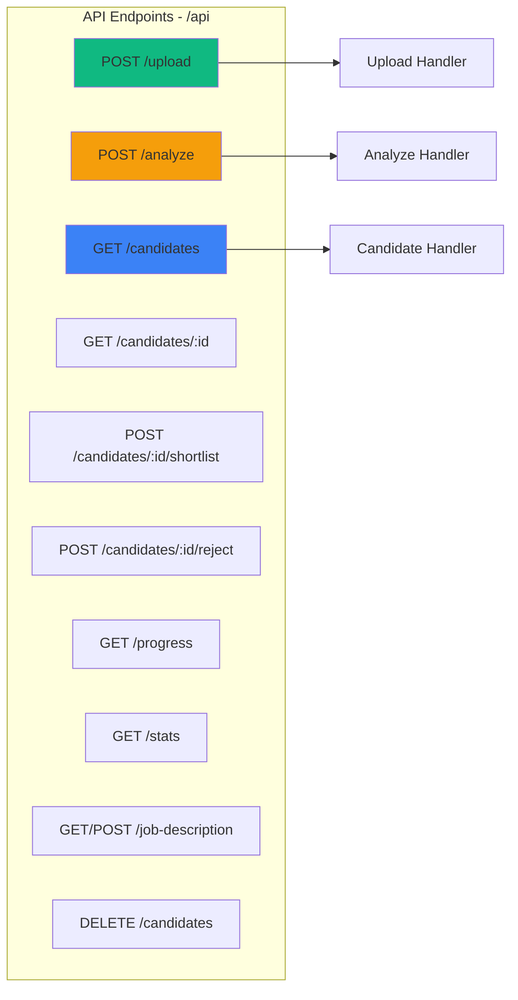

### Service Layer Architecture

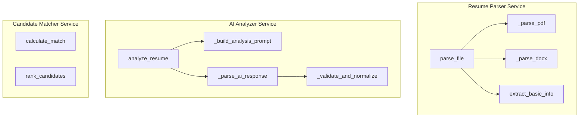

### Data Models (Pydantic Schemas)

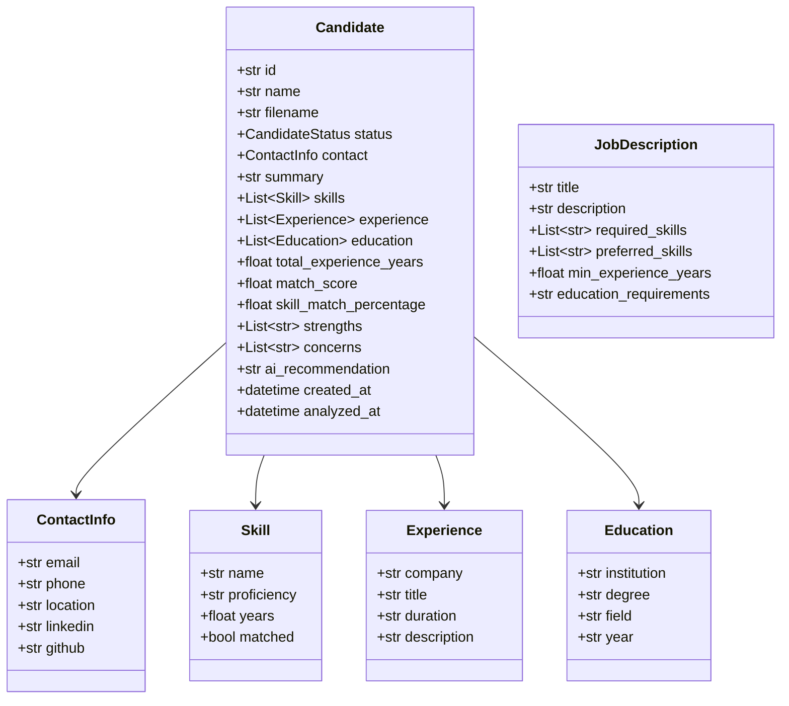

---

## Process Flows

### 1. Resume Upload Flow

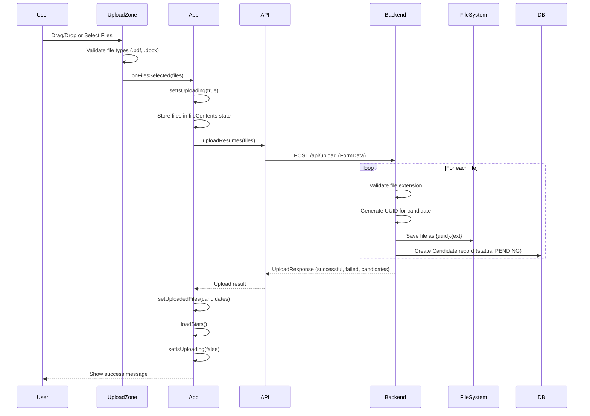

### 2. Backend AI Analysis Flow (Gemini)

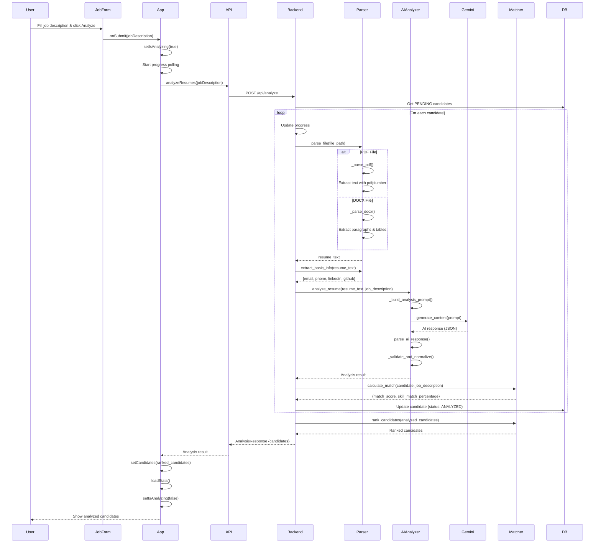

### 3. Puter.js AI Analysis Flow (Client-Side)

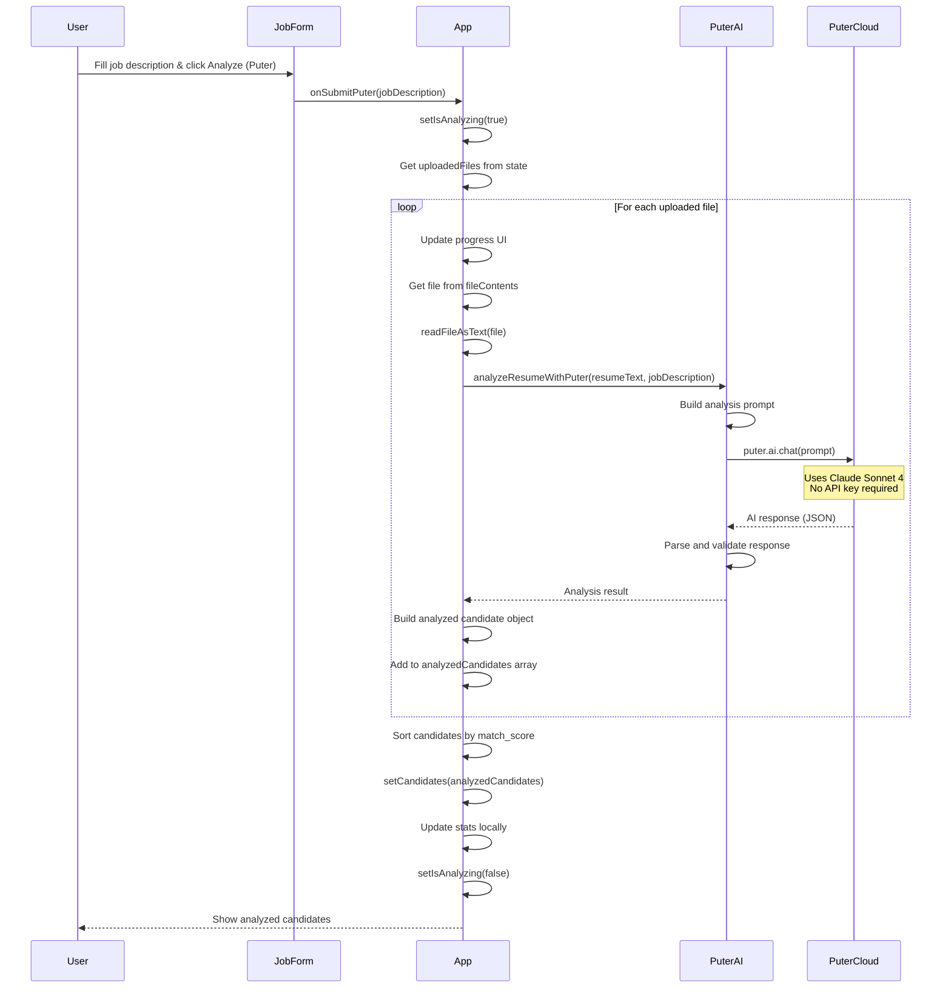

### 4. Candidate Management Flow

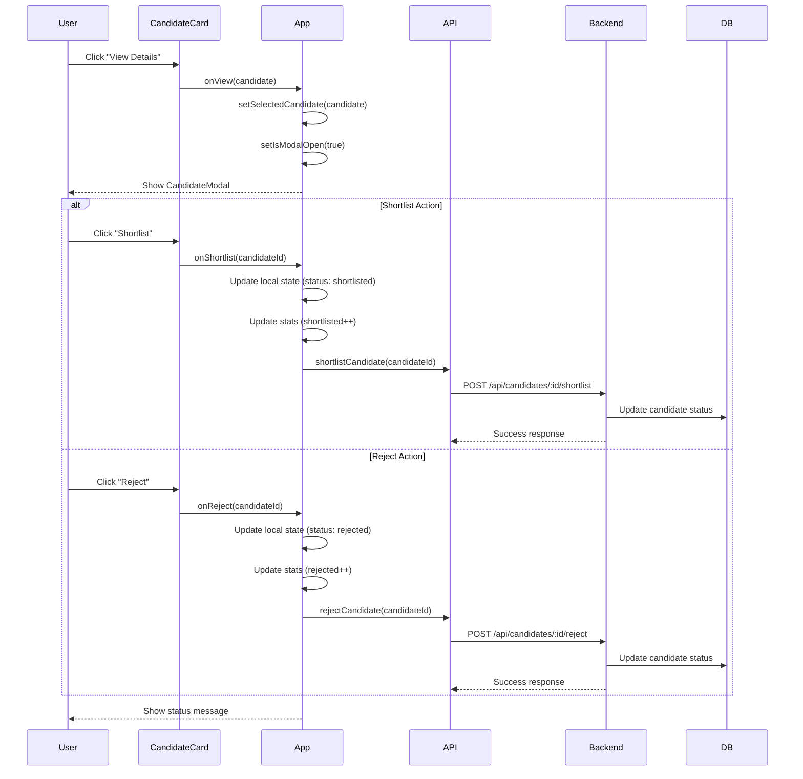

---

## Data Flow Diagrams

### Resume Upload Data Flow


### AI Analysis Data Flow (Backend Gemini)

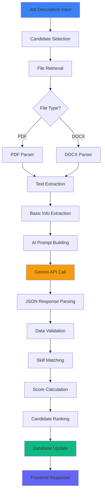

### AI Analysis Data Flow (Puter.js)

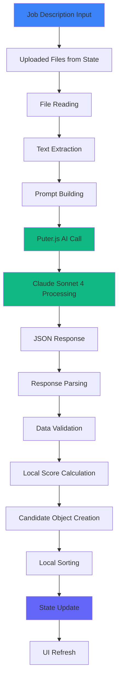

---

## Component Interactions

### Frontend Component Communication

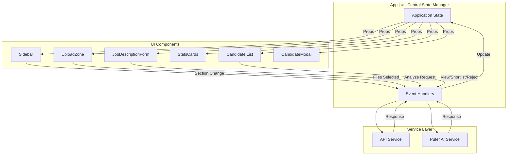

### Backend Service Interactions

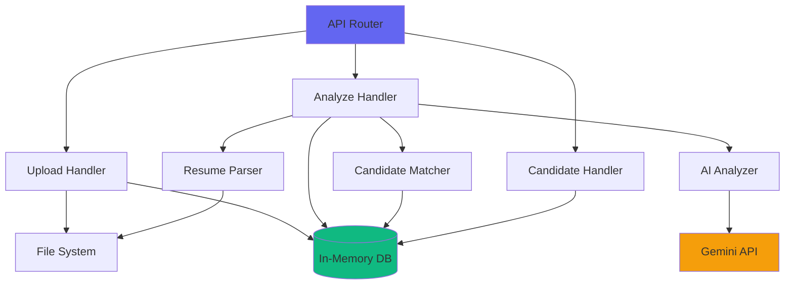

---

## Key Features & Workflows

### 1. **Dual AI Mode Support**

The application supports two AI analysis modes:

| Feature | Backend Gemini | Puter.js Free AI |
|---------|----------------|------------------|
| **API Key Required** | Yes (GEMINI_API_KEY) | No |
| **Processing Location** | Server-side | Client-side |
| **AI Model** | Google Gemini Pro | Claude Sonnet 4 |
| **Cost** | Pay-per-use | Free |
| **File Parsing** | Backend (PyPDF2, python-docx) | Frontend (limited) |
| **Data Storage** | Backend database | Frontend state only |

### 2. **Real-Time Progress Tracking**

```javascript
// Frontend polls backend every 1 second
const progressInterval = setInterval(async () => {
  const progressData = await api.getProgress();
  setProgress(progressData);
}, 1000);
```

Backend updates progress:

```python
screening_progress = {
    "status": "analyzing",
    "progress": 50,
    "current_file": "john_doe_resume.pdf",
    "step": "parsing"
}
```

### 3. **Candidate Filtering & Ranking**

Candidates are automatically ranked by:

1. **Match Score** (0-100) - Overall job fit
2. **Skill Match Percentage** (0-100) - Required skills coverage

Filters available:

- All candidates
- Analyzed only
- Shortlisted
- Rejected

### 4. **File Upload & Storage**

**Frontend:**

- Drag-and-drop or click to browse
- Multiple file selection
- File type validation (.pdf, .docx, .doc)

**Backend:**

- Files saved as `{uuid}.{extension}`
- Stored in `backend/uploads/` directory
- Linked to candidate records via UUID

---

## API Endpoints Reference

| Method | Endpoint | Purpose | Request Body | Response |
|--------|----------|---------|--------------|----------|
| `POST` | `/api/upload` | Upload resume files | FormData with files | UploadResponse |
| `POST` | `/api/analyze` | Analyze resumes | AnalysisRequest | AnalysisResponse |
| `GET` | `/api/candidates` | Get all candidates | Query params (status, min_score, limit) | {candidates, total} |
| `GET` | `/api/candidates/:id` | Get single candidate | - | Candidate |
| `POST` | `/api/candidates/:id/shortlist` | Shortlist candidate | - | {message, candidate} |
| `POST` | `/api/candidates/:id/reject` | Reject candidate | - | {message, candidate} |
| `GET` | `/api/progress` | Get analysis progress | - | ScreeningProgress |
| `GET` | `/api/stats` | Get statistics | - | Stats object |
| `GET/POST` | `/api/job-description` | Get/Set job description | JobDescription | JobDescription |
| `DELETE` | `/api/candidates` | Clear all data | - | {message} |
| `GET` | `/health` | Health check | - | {status, api_configured} |

---

## Security & Best Practices

### Current Implementation

✅ **Implemented:**

- CORS middleware for frontend communication
- File type validation
- Input sanitization via Pydantic models
- Error handling and logging

⚠️ **Production Considerations:**

1. **Database:** Replace in-memory storage with PostgreSQL/MongoDB
2. **Authentication:** Add user authentication and authorization
3. **File Storage:** Use cloud storage (S3, GCS) instead of local filesystem
4. **API Rate Limiting:** Implement rate limiting for AI API calls
5. **Data Privacy:** Encrypt sensitive candidate information
6. **File Size Limits:** Add file size validation
7. **Session Management:** Implement proper session handling
8. **HTTPS:** Use HTTPS in production
9. **Environment Variables:** Secure API key management

---

## Performance Optimization

### Frontend

- Lazy loading for candidate list
- Debounced search/filter operations
- Memoization for expensive computations
- Code splitting for routes

### Backend

- Async file processing
- Background tasks for long-running operations
- Caching for frequently accessed data
- Connection pooling for database

---

## Error Handling

### Frontend Error Handling

```javascript
try {
  const result = await api.analyzeResumes(jobDescription);
  // Success handling
} catch (error) {
  setStatusMessage({ 
    type: 'error', 
    text: 'Analysis failed. Is the backend running?' 
  });
}
```

### Backend Error Handling

```python
try:
    analysis = await ai_analyzer.analyze_resume(resume_text, jd_dict)
except Exception as e:
    logger.error(f"AI analysis failed: {str(e)}")
    return self._get_fallback_analysis(resume_text)
```

---

## Conclusion

This AI Resume Screener application demonstrates a modern full-stack architecture with:

- **Flexible AI Integration** - Dual mode support (Backend Gemini + Client-side Puter.js)
- **Robust File Processing** - Multi-format resume parsing (PDF, DOCX)
- **Real-Time Feedback** - Progress tracking and status updates
- **Clean Architecture** - Separation of concerns with service layers
- **User-Friendly Interface** - Intuitive UI with dark/light mode
- **Scalable Design** - Ready for production enhancements

The system efficiently processes resumes through a well-defined pipeline: Upload → Parse → Analyze → Match → Rank, providing recruiters with actionable insights for candidate evaluation.
